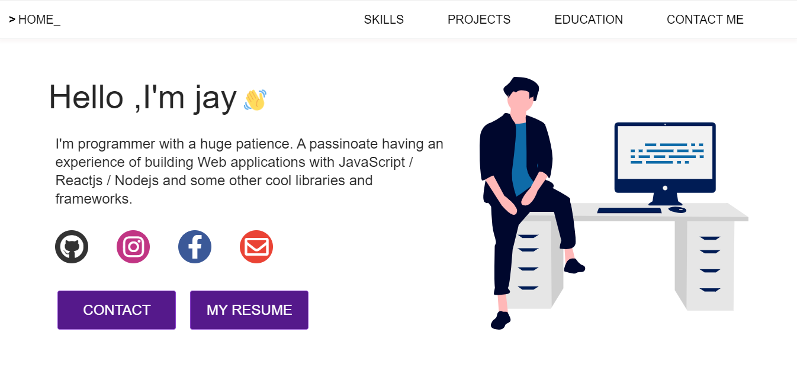

# Developer Portfolio ⚡️

&nbsp; &nbsp; It's my portfolio , which is atrractive and responsive in sense of design.

&nbsp; &nbsp; You can use it as a reference.
😇

<p align="center">
</img>
</p>

## Portfolio Sections

- Introduction
- Skills
- Projects
- Education
- Contact

## How to Use

```
# Clone this repository
git clone https://github.com/JayMalli/portfolio.git

# Go into th repository
cd portfolio

# Install dependencies
npm install

# Start a local server
npm start
```

Feel free to make changes in design and content of your portfolio. 😉

## Deployment

<br>

### Deploying to Netlify

Builds the app for production to the `build` folder.\

It correctly bundles React in production mode and optimizes the build for the best performance.

The build is minified and the filenames include the hashes.\

- `npm run build`

Your app is ready to be deployed!

You could also host directly with Netlify by linking your own repository.

[](https://www.netlify.com/)

For more information, read [hosting on Netlify](https://create-react-app.dev/docs/deployment/#netlify).

<br>

## 💻 Technologies used

- [ReactJs](https://reactjs.org/)
- [react-easy-emoji](https://github.com/appfigures/react-easy-emoji)
- [react-bootstrap](https://react-bootstrap.github.io/)

<br>

## 🎉 Acknowledgements

- [developerFolio](https://developerfolio.js.org/)
